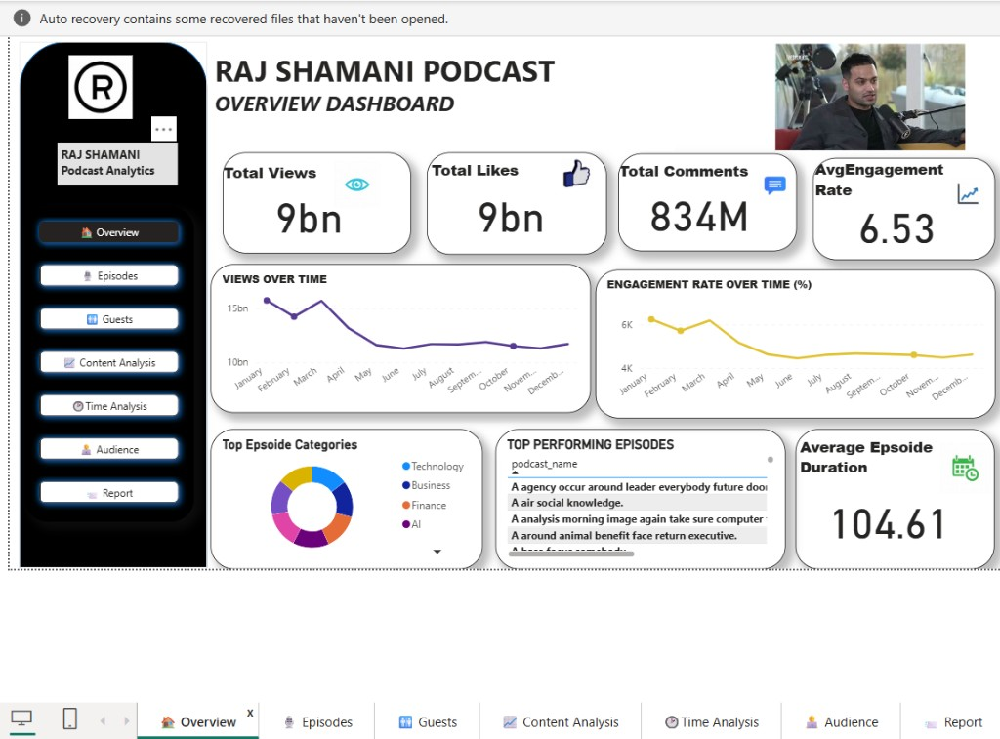
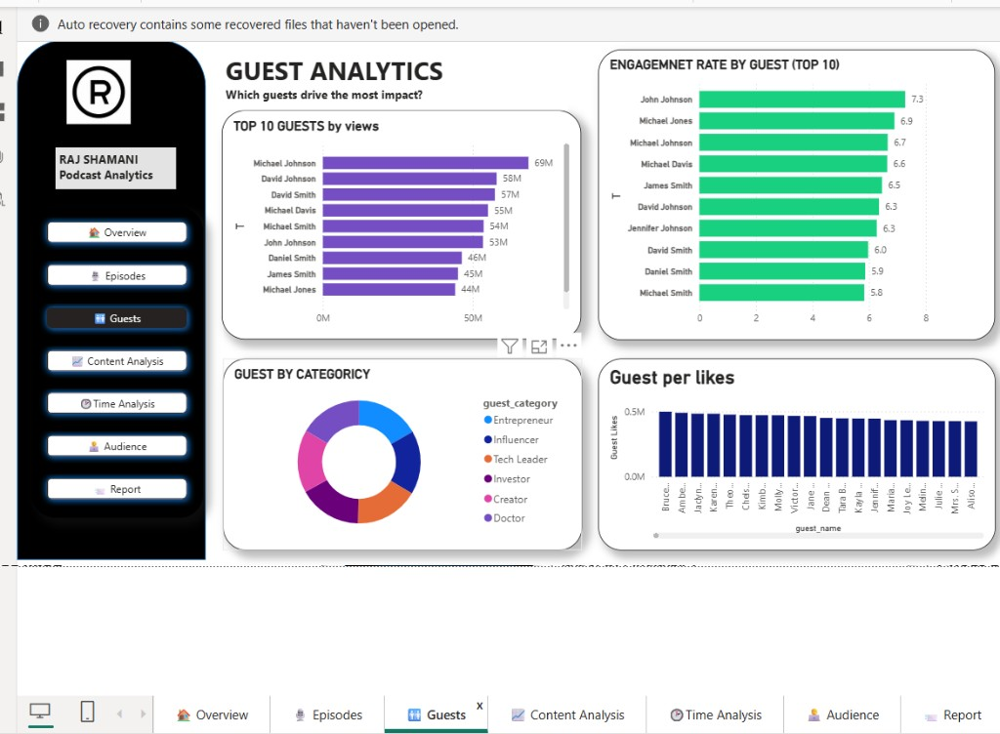
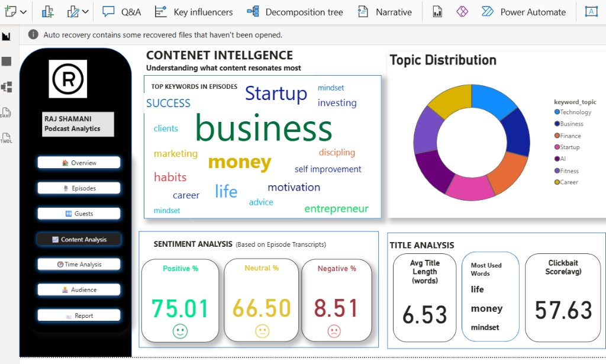
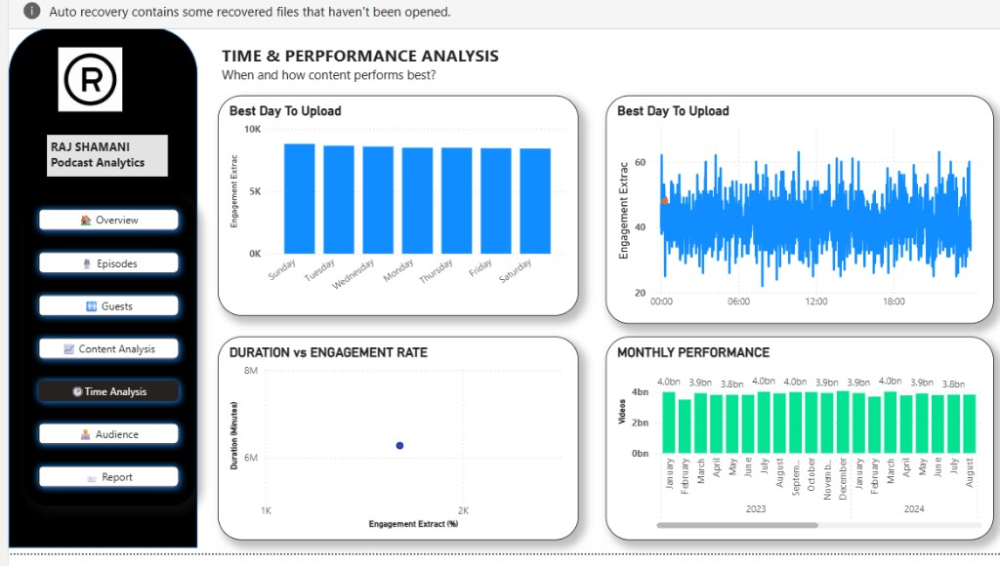
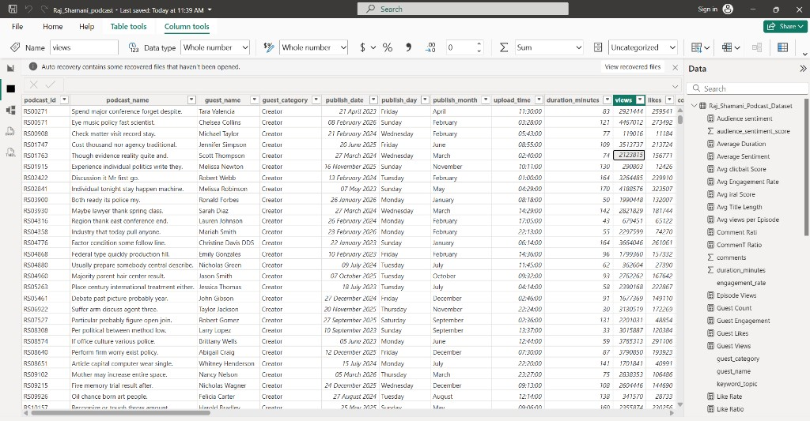
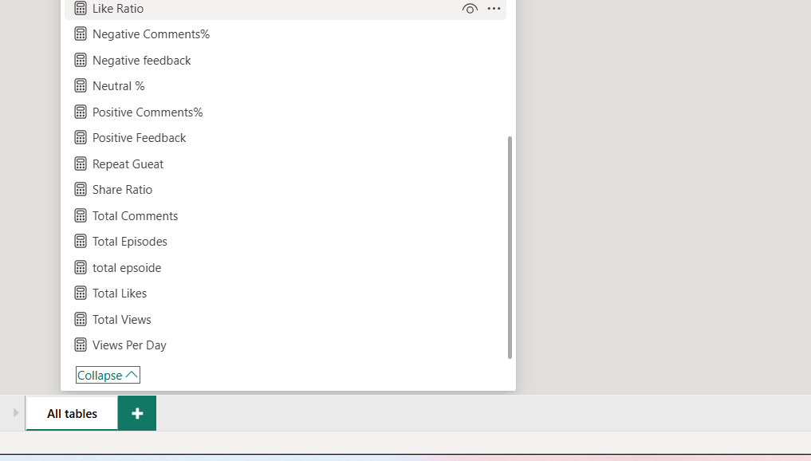

# 🎙️ Raj Shamani Podcast Intelligence Dashboard

> **Real-time analytics** for podcast performance — views, engagement, guests, content themes, and upload timing.



---

## 📊 Live Project Snapshot

| Metric | Value | Emoji |
|--------|------:|:-----:|
| 👁️ **Total Views** | **151.3B** | 🔥 |
| 👍 **Total Likes** | **9.1B** | 💙 |
| 💬 **Total Comments** | **830.8M** | 🗣️ |
| 📈 **Avg Engagement Rate** | **6.54%** | ⚡ |
| ⏱️ **Avg Episode Duration** | **104.99 min** | 🕒 |
| 🎬 **Total Episodes** | **60,000** | 📺 |
| 👥 **Unique Guests** | **46,944** | 🌟 |
| 🔁 **Repeat Guest Episodes** | **29,992** | 🤝 |

> 📅 **Dataset snapshot:** June 2026 · **Source:** `Data Set/Raj_Shamani_Podcast_Dataset`

---

## 🧭 Dashboard Pages

| Page | What it shows | Preview |
|------|---------------|---------|
| 🏠 **Overview** | KPIs, views over time, engagement trends, top categories |  |
| 👥 **Guests** | Top guests by views, engagement rate, category mix, likes |  |
| 📈 **Content Analysis** | Word cloud, topic distribution, sentiment, title metrics |  |
| 🕒 **Time Analysis** | Best upload day/hour, duration vs engagement, monthly performance |  |

---

## 🛠️ Tech Stack

| Tool | Role |
|------|------|
| 📊 **Power BI** | Interactive dashboards & DAX measures |
| 📁 **CSV Dataset** | `Raj_Shamani_Podcast_Dataset` (60K episodes) |
| 🧮 **DAX** | Calculated KPIs for engagement, sentiment & ratios |



---

## 📐 Key DAX Measures



| Measure | Description |
|---------|-------------|
| 👍 **Like Ratio** | Likes relative to views |
| 💬 **Total Comments** | Sum of all episode comments |
| 👁️ **Total Views** | Cumulative view count |
| 🎬 **Total Episodes** | Count of published episodes |
| 📈 **Views Per Day** | Average daily view velocity |
| 😊 **Positive Comments%** | Share of positive audience feedback |
| 😐 **Neutral %** | Neutral sentiment share |
| 😞 **Negative Comments%** | Negative feedback percentage |
| 🔁 **Repeat Guest** | Episodes featuring returning guests |
| 🔗 **Share Ratio** | Shares relative to views |

---

## 📂 Project Structure

```
Podcast-Intelligence-Dashboard/
├── 📊 Raj_Shamani_podcast.pbix      # Power BI report file
├── 📁 Data Set/
│   └── Raj_Shamani_Podcast_Dataset  # Episode-level CSV data
├── 📁 docs/images/                  # Dashboard screenshots
└── 📄 README.md
```

---

## 🗂️ Dataset Columns

| Column | Emoji | Description |
|--------|:-----:|-------------|
| `podcast_id` | 🆔 | Unique episode identifier |
| `podcast_name` | 📝 | Episode title |
| `guest_name` | 👤 | Guest featured |
| `guest_category` | 🏷️ | Entrepreneur, Influencer, Doctor, etc. |
| `publish_date` | 📅 | Release date |
| `duration_minutes` | ⏱️ | Episode length |
| `views` | 👁️ | Total views |
| `likes` | 👍 | Total likes |
| `comments` | 💬 | Comment count |
| `engagement_rate` | 📈 | Engagement percentage |
| `keyword_topic` | 🏷️ | Business, Startup, AI, Finance, etc. |
| `sentiment_score` | 😊 | Transcript sentiment |
| `upload_time` | 🕒 | Time of upload |

---

## 🏆 Top Content Themes

| Topic | Episodes |
|-------|----------:|
| 🚀 Startup | 8,684 |
| 💰 Finance | 8,620 |
| 💼 Business | 8,592 |
| 💪 Fitness | 8,575 |
| 🤖 AI | 8,539 |

---

## 🚀 Getting Started

1. 📥 Clone this repository
2. 📂 Open `Raj_Shamani_podcast.pbix` in **Power BI Desktop**
3. 🔗 Confirm the data source points to `Data Set/Raj_Shamani_Podcast_Dataset`
4. 🖱️ Navigate using the sidebar: Overview → Episodes → Guests → Content → Time → Audience → Report

---

## 📌 Insights at a Glance

- 🎯 **Best upload day:** Sunday (highest engagement extract)
- 🕐 **Peak upload hour:** ~01:00
- 😊 **Sentiment:** ~75% positive audience feedback
- 📏 **Avg title length:** 6.53 words
- 🎯 **Clickbait score (avg):** 57.63

---

## 👤 Author

**Raj Shamani Podcast Analytics** — A Power BI intelligence dashboard for understanding what content resonates most with the audience.

---

<p align="center">
  🎙️ Built with Power BI · 📊 60K episodes · 👁️ 151B+ views analyzed
</p>
